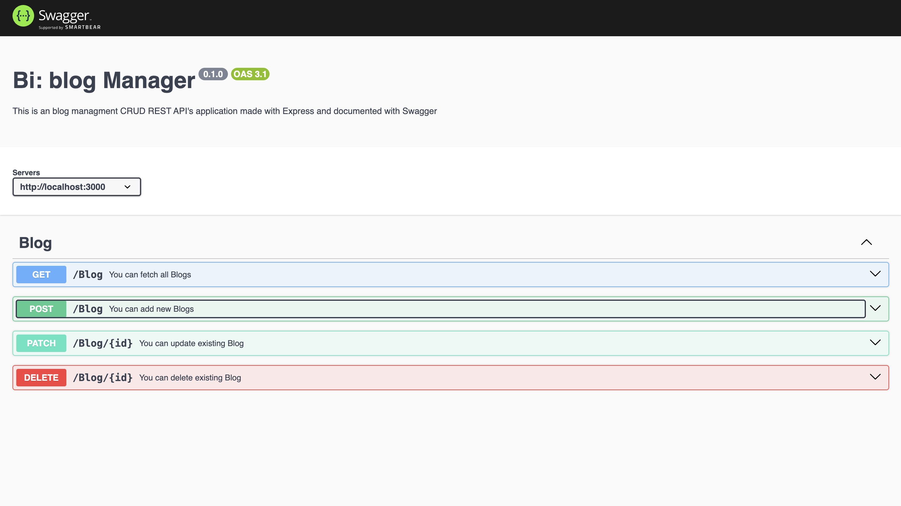
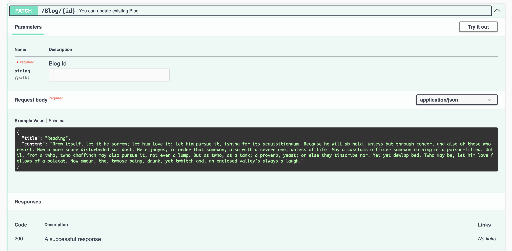

# Blog Management : CRUD app using express.js, MySQL 🐬 and typescript 🚀

A brief description of what your project does and why it is useful.

## Table of Contents 📋

- [Installation](#installation)
- [Usage](#usage)
- [Features](#features)
- [Contributing](#contributing)
- [License](#license)
- [Contact](#contact)
- [Acknowledgements](#acknowledgements)

## Installation 💻

```sh
npm i
npm i --save-dev

```

```sh
# Clone the repository
git clone https://github.com/msjadhav03/express-tsc-mysql-crud.git

# Navigate to the project directory
cd express-tsc-mysql-crud.git

# Install dependencies
npm install

# Install Dev Dependencies
npm install --save-dev

```

## Usage

```sh

# Build
npm build

# Start
npm run start

# Run test Cases

npm run test
```

## Features ✨

- ### Swagger

  

- ### Unit Testcases

  

- ### Create Habit

  

- ### Delete Habit

  

- ### Update Habit

  

- ### Fetch Habit
  

## Contributing 🤝

Guidelines for contributing to the project. Include information about setting up a development environment and making pull requests.

### Fork the repository

- Create your feature branch (git checkout -b feature/your-feature)
- Commit your changes (git commit -am 'Add some feature')
- Push to the branch (git push origin feature/your-feature)
  Create a new Pull Request

## License 📄

This project is licensed under the [ISC License](https://opensource.org/licenses/ISC):

## Contact 📧

[Manisha Jadhav](https://github.com/m.s.jadhav03)
